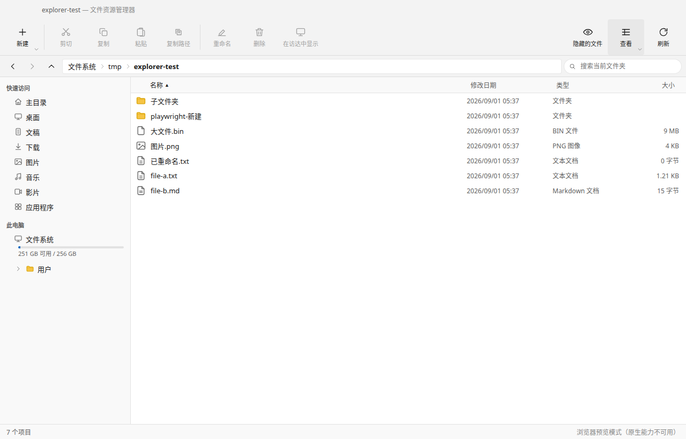
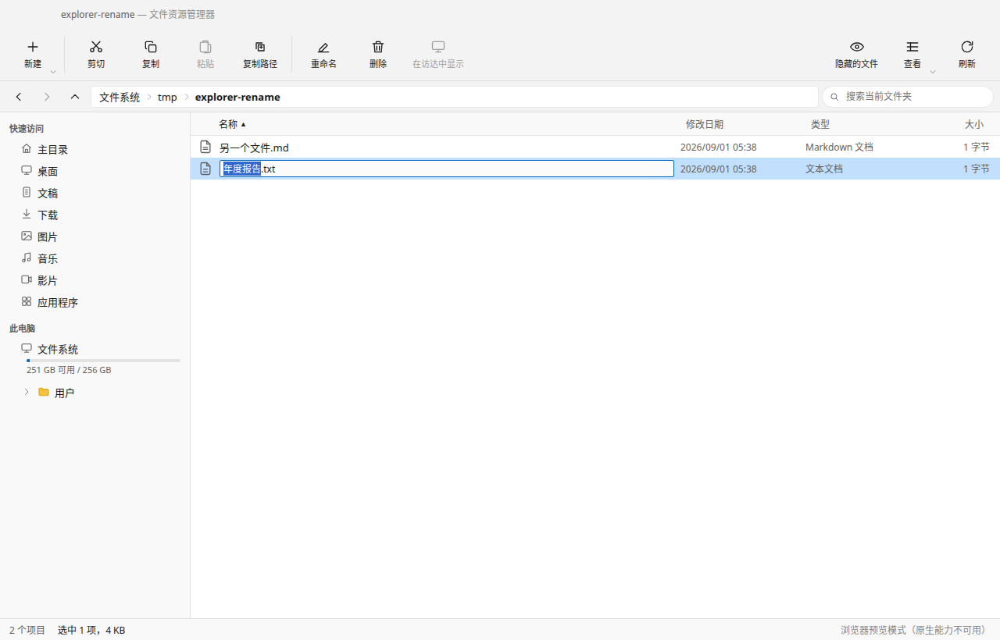
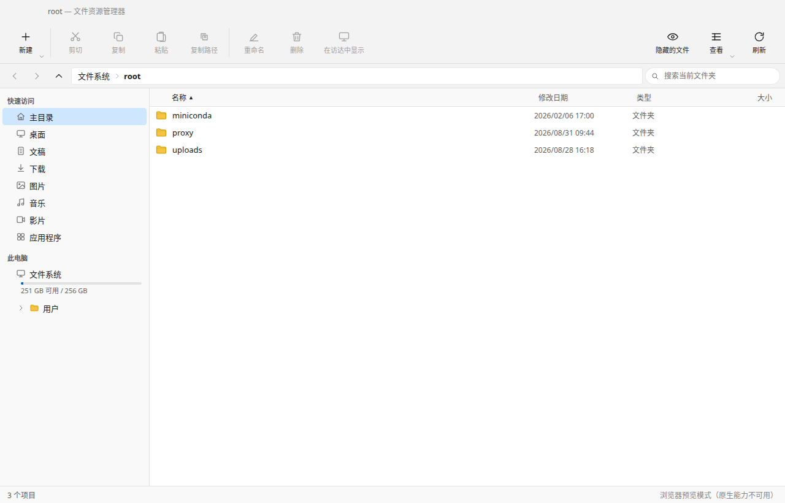
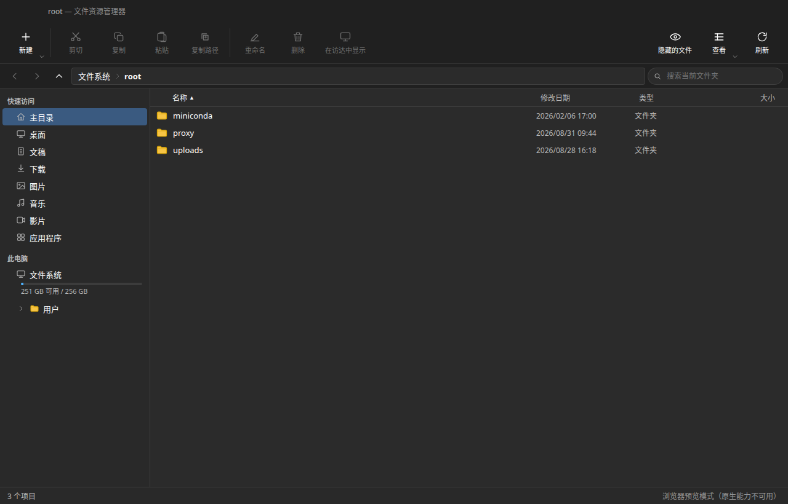
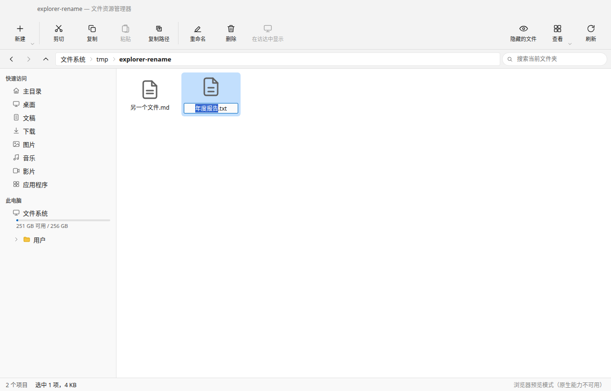

# Explorer —— macOS 上的 Windows 风格文件资源管理器

> 技术栈：Electron 43 + React 19 + TypeScript + Vite 7。源码一次编写，Electron 桌面版与浏览器预览版共用同一套业务逻辑。

## 功能

- 浏览整个磁盘（主目录、桌面、文稿、下载、图片、音乐、影片、应用程序、外置卷）
- 多窗口：Explorer 菜单“新建窗口”或 ⌘E，新窗口打开与当前窗口相同的目录；
  “窗口”菜单按当前目录名列出各窗口，方便切换
- 复制 / 移动 / 粘贴文件与文件夹，支持进度、ETA、取消、冲突决策
- 创建文件 / 文件夹（命令栏“新建”主按钮一键新建文件夹，默认名自动避重名，
  创建后直接进入行内重命名；右侧小箭头可选新建文件）、行内重命名（F2 就地编辑，
  自动选中主文件名、保留扩展名；鼠标慢双击已选中的项目也可进入重命名）、删除到废纸篓
- 调用系统默认程序打开文件（`shell.openPath`）
- 查看文件属性（大小、时间、权限、包含统计）
- 复制文件绝对路径到系统剪贴板
- 三种视图：详细信息、列表、大图标
- 详细信息视图可拖拽调整列宽，宽度跨会话保留，双击列头分隔条恢复默认
- 虚拟滚动：5000 个文件的目录首屏约 80ms，实际只渲染视口内的二三十行
- 完整键盘快捷键（⌘+C/X/V/A、⌘+E 新窗口、F2、F5、Delete、⌘+Backspace、⌘+⇧+.、方向键导航等）
- 原生菜单栏、隐藏文件切换、跟随系统深色模式

**明确不做**：内置文本编辑器、图片 / 视频 / PDF 预览面板。双击文件永远是调用 macOS 默认程序打开。

### 界面

| 详细信息视图 | 行内重命名 |
| --- | --- |
|  |  |

| 浅色 | 深色（跟随系统） |
| --- | --- |
|  |  |

大图标视图下的行内重命名：



---

## 快速开始

### 1. 环境

- macOS 13 / 14 / 15，Apple Silicon（M 系列）
- Node.js 20+（推荐 22 LTS）
- npm 10+

### 2. 安装

```bash
npm install
```

> **Electron 43 不再自动下载二进制。** 装完依赖后必须执行一次：
>
> ```bash
> npm run setup:electron
> ```
>
> 此命令会下载对应平台（macOS arm64）的 Electron 二进制。

### 3. 开发

浏览器预览（真实操作 UI，底层读写文件系统）：

```bash
npm run dev:web
# 打开 http://127.0.0.1:5173
```

桌面版开发（启动 .app 窗口）：

```bash
npm run dev
```

### 4. 构建

```bash
npm run build          # 构建 dist/main、dist/preload、dist/renderer
npm run typecheck      # TypeScript 类型检查
npm run check          # 校验 IPC/HTTP 契约一致性
```

### 5. 打包（生成 .app / .dmg）

**在项目根目录执行** —— 也就是有 `package.json` 的这个目录，不是 `src/`、不是 `dist/`：

```bash
pwd           # 应当能看到 .../explorer/package.json
ls package.json
```

确认位置没错，然后：

```bash
npm run dist
```

产物在 **`release/`** 目录下：

```
release/
├── Explorer-1.0.0-arm64.dmg     ← 给别人安装用这个
├── Explorer-1.0.0-arm64.zip
└── mac-arm64/
    └── Explorer.app             ← 自己用，直接拖到「应用程序」
```

> `npm run dist` 已经串联了图标生成（`scripts/make-icns.sh`，依赖 macOS 自带的
> `sips` / `iconutil`，无需额外安装）和构建，不需要单独跑。
>
> 只想快速看效果、不想等 dmg 封装，用 `npm run dist:dir`，只产出 `.app`。

**前置条件**：Xcode 命令行工具（electron-builder 打包 macOS 需要）。

```bash
xcode-select --install     # 若已安装会提示 command line tools are already installed
```

如果你打算签名分发（现在配置是 `identity: null`，即不签名），需要有 Apple Developer ID，
然后改 `electron-builder.yml` 里的 `identity` 并配好证书。不签名也能用，只是首次启动
会被 Gatekeeper 拦一下，见下一节。

---

## 首次运行 / Gatekeeper

未使用 Apple Developer ID 签名时，首次运行 .app 会被 Gatekeeper 拦截。

两种放行方式：

1. **右键 → 打开** `.app`
2. 终端执行：

```bash
xattr -dr com.apple.quarantine /Applications/Explorer.app
```

---

## TCC 授权

首次访问"桌面""文稿""下载"等受保护目录时，macOS 会弹窗授权。请在：

> 系统设置 → 隐私与安全性 → 完全磁盘访问权限

为 Explorer.app 打开开关，否则无法读取这些目录的内容。

---

## 架构

```
src/shared/   契约与纯函数（禁止 import node:* / electron）
src/core/     唯一业务逻辑（只依赖 node:*，禁止 import electron）
src/main/     Electron 主进程（IPC + shell + 图标）
src/preload/  contextBridge 暴露 window.electronAPI
src/server/   Express 预览通道（永不进打包产物）
src/renderer/ React UI（只认 api/ 抽象接口）
```

**关键约束**：`core/` 严禁 `import 'electron'`。平台能力全部经 `HostAdapter` 接口收敛，Web 通道对不支持的能力返回 `UNSUPPORTED`，UI 自动灰显按钮。

**防漂移三重保障**：

1. 编译期：`handlers: ApiHandlers` 缺方法即失败
2. 类型期：IPC client 与 HTTP client 都断言为同一个 `Api` 类型
3. 运行期：`npm run check` 断言 IPC 通道 === 契约键 === Express 路由

---

## 开发提示

- `npm run dev:web` 的后端会 watch `src/core`、`src/shared`、`src/server`，改动后自动重建并重启 API 进程
- `npm run dev` 的 main/preload 用 esbuild watch，renderer 用 vite，electronmon 负责重启 Electron
- 浏览器预览模式下，原生能力（系统打开 / 废纸篓 / 系统图标 / Finder 中显示）不可用，按钮会自动灰显
- 删除在浏览器预览模式下只移到临时目录，不真删

---

## 已知取舍

- `fs.copyFile` 不保留 macOS 扩展属性与 resource fork（Finder 标签等）。v1 接受，后续可添加 `ditto` 保真模式开关。
- 图标默认用内置 SVG；桌面版会额外请求 `app.getFileIcon`，缓存 200 项。

---

## 推送代码到 GitHub

仓库已经 `git init` 并完成了首次提交，你只需要加远端推一次：

```bash
git remote add origin https://github.com/<你>/<仓库>.git
git branch -M main
git push -u origin main
```

> `.gitignore` 已排除 `node_modules/`、`dist/`、`release/` 和日志，
> 首次提交里只有源码、配置、文档和截图。

---

## 许可证

MIT
